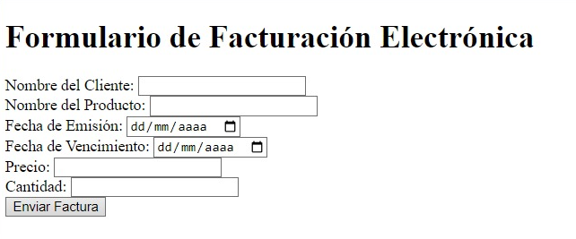
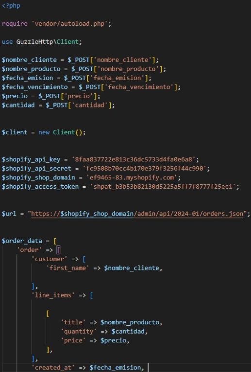
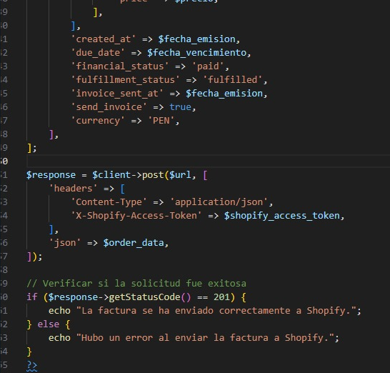
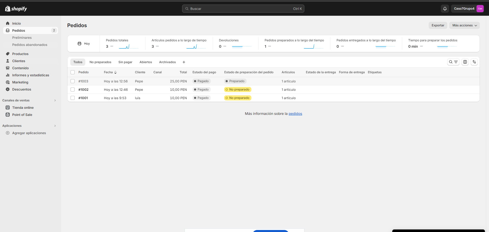

# Api para el formulario
------

## Ejemplo formulario de factura
Aqui tenemos el formulario mas el codigo del php que envia el contenido a shopify
 
  
 
 
  
 
 
  
 

## Resultado en el shopify
En esta parte veriamos las facturas resividas desde el formualrio
 
  
 
