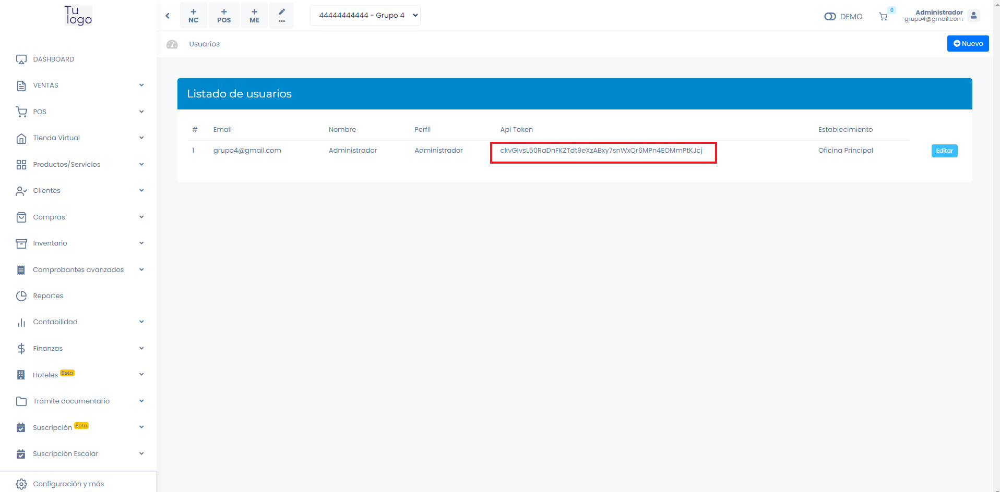
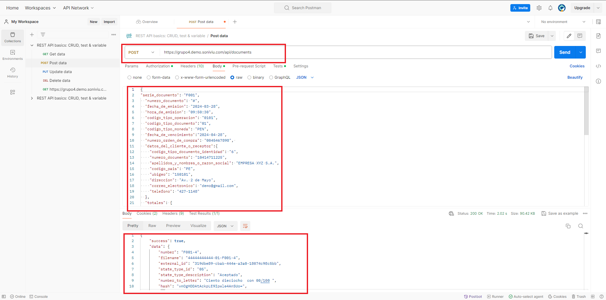
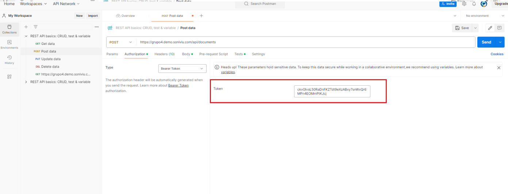
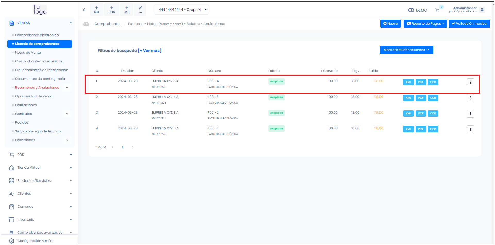

# Ejemplo usando PostMan para facturacion

Facturacion electronica

 --------
## Descripción
 Hemos usado el postman para pobrar el ejemplo del que esta en la documentacion

**https://fastura.github.io/admin/API-rest-documentacion/Introduccion**
## Accesos
Inicialmente para hacer el uso de la api, necesitas un token y la url.

1. URL: https://grupo4.demo.soniviu.com/api/documents
2. TOKEN: ckvGIvsL50RaDnFKZTdt9eXzABxy7snWxQr6MPn4EOMmPtKJcj
:::tip IMPORTANTE
El Token lo puede extraer desde la plataforma en el módulo USUARIOS, LOCALES Y SERIES - USUARIOS:
 <center>  [](img/img1.png)</center> 

:::
## Configuracion Postman


1. Método: POST
2. URL: https://grupo4.demo.soniviu.com/api/documents
3. TOKEN: ckvGIvsL50RaDnFKZTdt9eXzABxy7snWxQr6MPn4EOMmPtKJcj

## JSON A ENVIAR
```bash
{
  "serie_documento": "F001",
  "numero_documento": "#",
  "fecha_de_emision": "2024-03-28" <-- se cambio la fecha,
  "hora_de_emision": "10:11:11",
  "codigo_tipo_operacion": "0101",
  "codigo_tipo_documento":"01",
  "codigo_tipo_moneda": "PEN",
  "fecha_de_vencimiento":"2024-03-28" <-- se cambio la fecha,
  "numero_orden_de_compra": "0045467898", 
  "datos_del_cliente_o_receptor":{
    "codigo_tipo_documento_identidad": "6",
    "numero_documento": "10414711225",
    "apellidos_y_nombres_o_razon_social": "EMPRESA XYZ S.A.",
    "codigo_pais": "PE",
    "ubigeo": "150101",
    "direccion": "Av. 2 de Mayo",
    "correo_electronico": "demo@gmail.com",
    "telefono": "427-1148"
  },
  "totales": {
    "total_exportacion": 0.00,
    "total_operaciones_gravadas": 100.00,
    "total_operaciones_inafectas": 0.00,
    "total_operaciones_exoneradas": 0.00,
    "total_operaciones_gratuitas": 0.00,
    "total_igv": 18.00,
    "total_impuestos": 18.00,
    "total_valor": 100,
    "total_venta": 118
  },
  "items":[
    {
      "codigo_interno": "P0121",
      "descripcion":"Inca Kola 250 ml",
      "codigo_producto_sunat": "51121703",
      "unidad_de_medida": "NIU",
      "cantidad": 2,
      "valor_unitario": 50,
      "codigo_tipo_precio": "01",
      "precio_unitario": 59,
      "codigo_tipo_afectacion_igv": "10",
      "total_base_igv": 100.00,
      "porcentaje_igv": 18,
      "total_igv": 18,
      "total_impuestos": 18,
      "total_valor_item": 100,
      "total_item": 118
    }
  ],
  "informacion_adicional": "Forma de pago:Efectivo|Caja: 1"
}
```
## JSON RESPUESTA

```bash
{
    "success": true,
    "data": {
        "number": "F001-4",
        "filename": "44444444444-01-F001-4",
        "external_id": "319dbe89-cbab-444e-a3a0-18074c98c5bb",
        "state_type_id": "05",
        "state_type_description": "Aceptado",
        "number_to_letter": "Ciento dieciocho  con 00/100 ",
        "hash": "vnOgHDDAtAckpLE9Ipwle4AnSUo=",
        "qr": "iVBORw0KGgoAAAANSUhEUgAAAJYAAACWCAIAAACzY+a1AAAACXBIWXMAAA7EAAAOxAGVKw4bAAAgAElEQVR4AQCbgGR",
        "id": 4
    },
    "links": {
        "xml": "https://grupo4.demo.soniviu.com/downloads/document/xml/319dbe89-cbab-444e-a3a0-18074c98c5bb",
        "pdf": "https://grupo4.demo.soniviu.com/downloads/document/pdf/319dbe89-cbab-444e-a3a0-18074c98c5bb",
        "cdr": "https://grupo4.demo.soniviu.com/downloads/document/cdr/319dbe89-cbab-444e-a3a0-18074c98c5bb"
    },
    "response": {
        "code": "0",
        "description": "La Factura numero F001-4, ha sido aceptada",
        "notes": []
    }
}
```
## Captura de los resultados en el postman y en la web
En esta parte probamos el JSON y verificamos si se envia correctamente a la web

### Ejemplo postman 
 <center>  [](img/IMG2.png)</center> 
<center>
[](img/img3.png)
</center>


### Resultado en la web

<center> [](img/img5.png)</center> 
